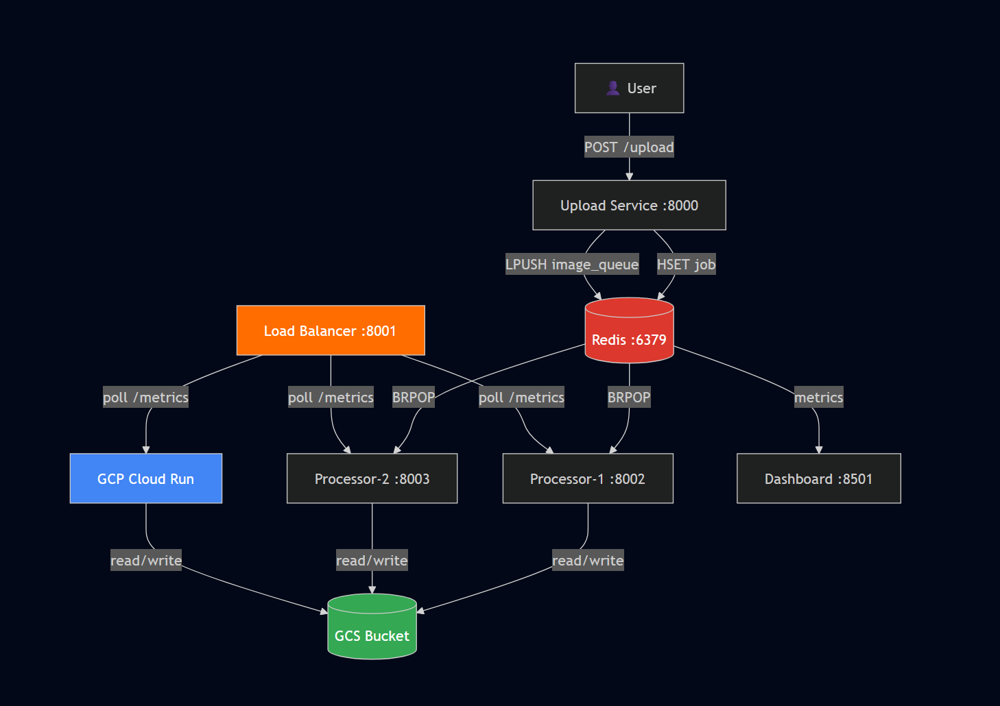
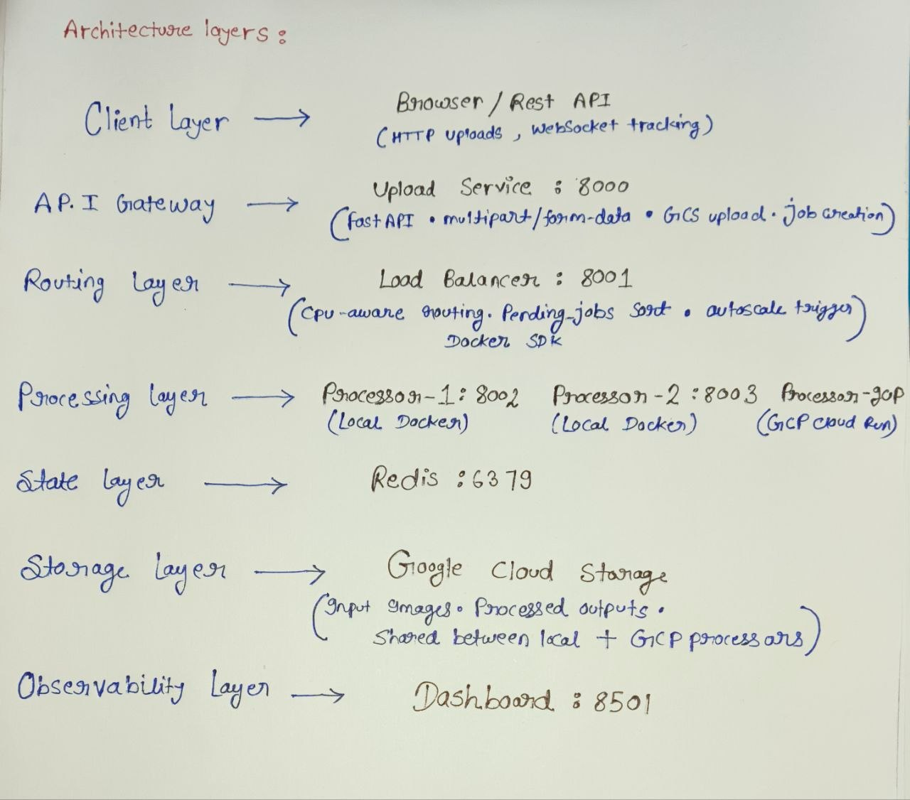

# PixelRouter — Architecture

## Overview
PixelRouter is a scalable hybrid cloud image processing platform.
It accepts image uploads, removes backgrounds, generates captions,
and routes jobs intelligently across local Docker containers and
GCP Cloud Run using a custom CPU-aware load balancer.

## Services

| Service | Port | Responsibility |
|---------|------|----------------|
| upload-service | 8000 | Accept uploads, create jobs, manage queue |
| load-balancer | 8001 | Route jobs to least-loaded processor |
| processor-1 | 8002 | AI image processing (local) |
| processor-2 | 8003 | AI image processing (local) |
| processor-gcp | Cloud Run | AI image processing (cloud) |
| dashboard | 8501 | Real-time monitoring |
| redis | 6379 | Job state, queue, metrics |

## Request Flow

1. User uploads image → upload-service (port 8000)
2. upload-service creates job in Redis (HSET job:{id})
3. upload-service pushes job_id to Redis queue (LPUSH image_queue)
4. Processor worker pops job (BRPOP image_queue)
5. Processor runs AI pipeline (rembg + BLIP)
6. Processor writes result to GCS, updates Redis job status
7. Dashboard reads Redis metrics in real time

## Load Balancing Strategy

- Each processor exposes /metrics (CPU%, pending jobs)
- Each processor also writes metrics to Redis with 10s TTL
- Load balancer reads Redis, routes to lowest pending_jobs
- CPU% used as tiebreaker
- If all processors > 80% CPU → autoscale via Docker SDK

## Hybrid Cloud Design

- Local tier: processor-1 and processor-2 (Docker Compose)
- Cloud tier: processor on GCP Cloud Run (autoscaling)
- Load balancer treats both tiers identically
- GCS used as shared storage between local and cloud processors

## Architecture Diagram

